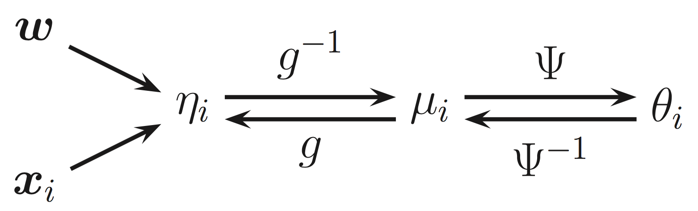
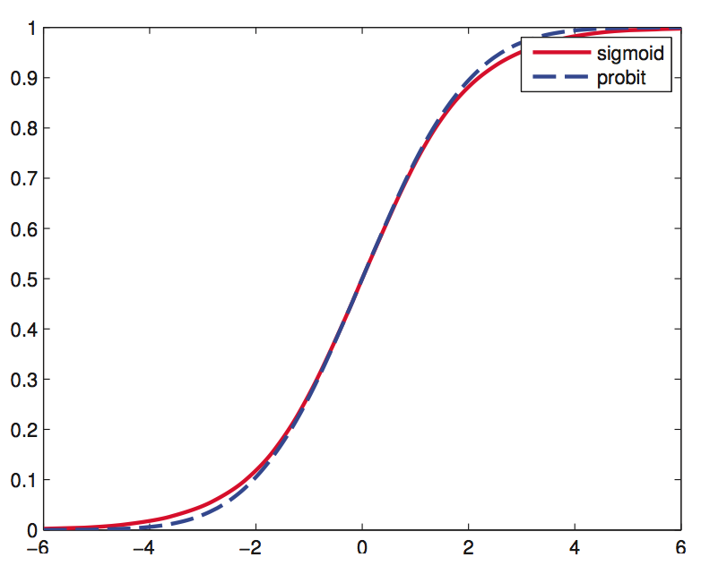
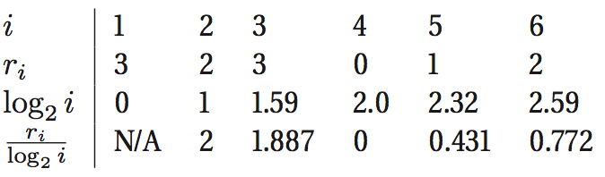

#Chapter 9
@(MLaPP)[MLapp]

[TOC]

---

---

---

## 参考资料
- [Sufficient Statistics and Exponential Family](http://people.missouristate.edu/songfengzheng/Teaching/MTH541/Lecture%20notes/Sufficient.pdf)
- [CS229 machine learning](http://open.163.com/movie/2008/1/E/D/M6SGF6VB4_M6SGHKAED.html)

## 9.1 Introduction
我们之前见到的很多概率分布，例如：高斯分布、伯努利分布和伽马分布、泊松分布等，都是一个更广泛分布的成员，这个分布就是**指数家族**。这章将会介绍这类分布的特性、运用等。(*均匀分布、学生t分布不属于指数家族*)
- 我们可以运用指数家族里的任何一个成员作为我们之前提到的生成模型的类条件密度(class-conditional density)
- 另外，我们在这章也会讨论怎么建立一个判别模型，模型的反应变量 (response variable)具有一个指数家族分布，这个分布的均值是输入的一个线性函数，这种模型叫做**广义线性模型**，之前章节提到的 linear regression 和 logistic regression 都属于 GLMs。

> 所以，这章的主要是将之前提到的分布或模型进行一般化，建立一个统一的表达形式，这样的好处就是对于通用分布/模型推导出的性质或MLE 求解形式等，这些具体的分布/模型写成通用形式后，都可以直接套用。

## 9.2 The exponential family
定义指数家族之前，先说说指数家族为什么重要：
- 在一定正则条件下，指数家族是唯一具有有限数量充分统计量的分布家族，意味着可以将数据压缩成有限大小的表示，但不会损失信息。
    > 充分统计量：将样本加工为统计量时，信息无损失，则称此统计量为充分统计量。数学化表达:
    - 随机样本 $X = \{X_1, ..., X_n\}$是从分布 $f(x|\theta)$ 产生的,这个分布依赖于未知参数 $\theta$, 而我们需要从这随机样本中估计参数 $\theta$
    - 统计量：样本观测的任意实值函数 $T(x) = r(X_1,...,X_n)$，例如 $E(X), max(X), median(X)$
    - 充分统计量：吸收了样本关于 $\theta$ 的所有有效信息，即 $p(\theta|X) = p(\theta|T(x))$
    - 例如，对于高斯分布 $\mathcal{N}(\mu, \sigma^2)$ 所生成的样本 $X$ ，其充分统计量是 $(E(X), S^2)$ 
    *其实，在很多问题上，$\hat{\theta}$ 的 MLE 就是一个充分统计量*

- 指数家族是一个共轭先验存在的家族（原文不严谨，说是唯一一个，但有一些非指数家族其实也存在共轭先验）
- 在满足用户给定的约束条件下，指数家族是做出最少假设的分布。
- 指数家族是广义线性模型的核心。
- 指数家族是变分推断的核心。

### 指数家族定义
对于$x=(x_1,...,x_m)\in\mathcal{X}^m$ 和 $\theta \in \Theta \subseteq \mathbb{R}^d$，分布的 pdf 或 pmf 满足以下形式的即为指数家族：
\begin{aligned}
p(x|\theta)\ &= \frac{1}{Z(\theta)}h(x)exp[\theta^T\phi(x)]\\
             &= h(x)exp[\theta^T\phi(x) - A(\theta)]
\end{aligned}
其中，$Z(\theta) = \int_{\mathcal{X}_m}h(x)exp[\theta^T\phi(x)]dx$ 是归一化因子，$A(\theta) = \text{log}Z(\theta)$
- $\theta$ 被称为自然参数 (natural parameters) 或正则参数 (canonical parameters)
- $\phi(x) \in \mathbb{R}^d$ 被称为充分统计量的一个向量
- $Z(\theta)$ 被称为归一化函数(partition function)
- $A(\theta)$ 被称为对数归一化函数(log partition function)，或累积量函数(cumulant function)
- h(x)是一个缩放常量，通常为1

> 更一般化的写法：
$$p(x|\theta)\ = h(x)exp[\eta(\theta)^T\phi(x) - A(\eta(\theta))]$$
其中 $\eta$ 是将参数 $\theta$ 映射成自然参数 $\eta = \eta(\theta)$
- 如果$dim(\theta) < dim(\eta(\theta))$，意味着充分统计量个数比参数多，这被称为曲指数家族(curved exponential family)
- 如果$dim(\theta) = dim(\eta(\theta))$，称为正则形式(canonical form), 在这本书里默认模型都是正则形式。

### 指数家族的例子
- 伯努利分布
对于 $x \in \{0,1\}$,可以写成如下指数家族形式：
\begin{aligned}
\text{Ber}(x|\mu) &= \mu^x(1-\mu)^{(1-x)} = \text{exp}[x\text{log}(\mu) + (1-x)\text{log}(1-\mu)] \\
&= \text{exp}[\phi(x)^T\theta]
\end{aligned}
其中$\phi(x) = [\mathbb{I}(x=0), \mathbb{I}(x=1)]$和$\theta = [\text{log}(\mu), \text{log}(1-\mu)]$
但是这种表示方式是过于完备的(over-complete)，因为特征之间是线性相关的：
$$\mathbb{I}(x=0) + \mathbb{I}(x=1) = 1$$
因此，$\theta$ 不是唯一可识别的，但一般要求指数家族的表达形式是最小的(minimal)，意味着有唯一的 $\theta$ 对应着这个分布。
所以可以将伯努利分布写成最小形式:
$$\text{Ber}(x|\mu) = (1-\mu)\text{exp}\Big[x\text{log}\big(\frac{\mu}{1-\mu}\big)\Big]$$
所以有$\phi(x) = x, \theta=\text{log}(\frac{\mu}{1-\mu})$ 和 $Z = 1/(1-\mu)$
$A(\theta) = \text{log}Z(\theta) = \text{log}(1+e^\theta)$
可以从自然参数 $\theta$ 还原均值参数 $\mu$:
$$\mu = sigm(\theta)=\frac{1}{1+e^{-\theta}}$$
> 扩展：
一般指数家族的表达式中的充分统计量向量 $\phi(x)$ 是最小充分统计量向量时，即可得到最小的指数家族表达形式。
**最小充分统计量**: 对于最小充分统计量 $S = T(X)$, 对于其他充分统计量 $T'(X)$，$T(X)$ 是 $T'(X)$ 的一个函数。
*一般，参数的MLE估计就是最小充分统计量*

- 单变量高斯分布
单变量高斯分布可以写成如下指数家族形式：
\begin{aligned}
\mathcal{N}(x|\mu, \sigma^2) &= \frac{1}{(2\pi\sigma^2)^{\frac{1}{2}}}\text{exp}[-\frac{1}{2\sigma^2}(x-\mu)^2]\\
&= \frac{1}{(2\pi\sigma^2)^{\frac{1}{2}}}\text{exp}[-\frac{1}{2\sigma^2}x^2+\frac{\mu}{\sigma^2}x - \frac{1}{2\sigma^2}\mu^2]\\
&=\frac{1}{Z(\theta)}\text{exp}(\theta^T\phi(x))
\end{aligned}
其中：
$\theta = [\frac{\mu}{\sigma^2}, \frac{-1}{2\sigma^2}]^{T}$
$\phi(x)=[x, x^2]^T$
$Z(\mu, \sigma^2)=\sqrt{2\pi}\sigma\text{ exp}[\frac{\mu^2}{2\sigma^2}]$
$A(\theta) = \frac{-\theta_1^2}{4\theta_2} - \frac{1}{2}\text{log}(-2\theta_2) - \frac{1}{2}\text{log}(2\pi)$ 

>非指数家族例子
- 均值分布，因为它的样本空间依赖于参数
- 学生t分布，不能写成指数家族的表达形式

### 对数归一化函数
指数家族的一个重要性质就是对数归一化函数 $A(\theta)$ 的导数可以用来生成充分统计量的累积量 (cumulants)，所以 $A(\theta)$ 也被称为累积量函数。
> 补充说明
一个分布的第一和第二累计量分布是充分统计量的均值 $\mathbb{E}[X]$ 和方差 $\text{var}[X]$，而第一和第二矩 (moments) 是他们的均值 $\mathbb{E}[X]$ 和 $\mathbb{E}[X^2]$

- $A(\theta)$ 的一阶导
\begin{aligned}
\frac{dA}{d\theta} &= \frac{d}{d\theta}\Big(log\int \text{exp}(\theta\phi(x))h(x)dx\Big) \\
&= \frac{\frac{d}{d\theta}\int \text{exp}(\theta\phi(x))h(x)dx}{\int\text{exp}(\theta\phi(x))h(x)dx} \quad\#链式求导,先对\text{log}求导\\
&= \frac{\int\phi(x)\text{exp}(\theta\phi(x))h(x)dx}{\text{exp}(A(\theta))} \quad\#分子对\theta求导\\
&=\int\phi(x)\text{exp}(\theta\phi(x) - A(\theta))h(x)dx\\
&=\int\phi(x)p(x)dx\\
&=\mathbb{E}[\phi(x)]
\end{aligned}

- $A(\theta)$ 的二阶导
\begin{aligned}
\frac{d^2A}{d\theta^2} &= \frac{d}{d\theta}\int\phi(x)\text{exp}(\theta\phi(x)-A(\theta))h(x)dx \\
&=\int\phi(x)\text{exp}(\theta\phi(x)-A(\theta))h(x)(\phi(x)-A'(\theta))dx\\
&=\int\phi(x)p(x)(\phi(x) - A'(\theta))dx\\
&=\int\phi^2(x)p(x)dx-A'(\theta)\int\phi(x)p(x)dx \\
&= \mathbb{E}[\phi^2(x)] - \mathbb{E}[\phi(x)]^2\\
&= \text{var}[\phi(x)]
\end{aligned}

- 多变量情况下
可以推导出 $\triangledown^2A(\theta) = \text{cov}[\phi(x)]$
因为协方差矩阵是正定矩阵，所以 $A(\theta)$ 是凸函数

- 例子：伯努利分布
从上面可知，$A(\theta) = 1 + e^\theta$
而伯努利分布的充分统计量向量$\phi(x) = x$
所以均值 $\mathbb{E}(x) = \frac{dA}{d\theta} = \frac{e^{\theta}}{1+e^{\theta}} = \frac{1}{1 + e^{-\theta}} = \text{sigm}(\theta) = \mu$
方差 $\text{var}(x) = \frac{d}{d\theta}(1+e^{-\theta})^{-1} = (1+e^{-\theta})^{-2}e^{-\theta} = (1-\mu)\mu$

### 指数家族的MLE
- 指数家族模型的似然：
\begin{aligned}
p(\mathcal{D}|\theta) &= \prod\limits_{i=1}^{N}p(x_i|\theta)\\
&=\Big[\prod\limits_{i=1}^Nh(x_i)\Big]g(\theta)^N\text{exp}\Big(\eta(\theta)^T[\sum\limits_{i=1}^N\phi(x_i)]\Big)
\end{aligned}
其中 $g(\theta) = \frac{1}{Z(\theta)}$
可以看出模型的充分统计量是 $N$ 和
$$\phi(\mathcal{D}) = [\sum\limits_{i=1}^N\phi_1(x_i),...,\sum\limits_{i=1}^N\phi_K(x_i)]$$
其中，$K$ 表示分布有 $K$ 个充分统计量
例如：对于伯努利模型，$\phi = [\sum_i\mathbb{I}(x_i = 1)]$，对于单变量高斯模型，$\phi = [\sum_ix_i, \sum_ix_i^2]$ （同时，我们也需要知道样本大小，$N$）

> Pitman-Koopman-Darmois theorem
在一定正则条件下，指数家族是唯一一个具有有限充分统计量的分布家族，这里的有限指充分统计量的数量和样本集大小是独立的。
这个定理要求的其中一个条件就是分布的样本空间不依赖于参数（书中拿均匀分布作为例子，虽然均匀分布具有有限的充分统计量，但是它不是指数家族，因为它的样本空间依赖于参数）

- 计算**正则**指数家族的模型的MLE
对于给定 $N$ 个服从 iid 的数据集 $\mathcal{D} = (x_1, ..., x_N)$ , 它的对数似然是：
$$\text{log}p(\mathcal{D}|\theta) = \theta^T\phi(\mathcal{D}) - NA(\theta)$$
可以看出这里令 $h(x) = 1$
因为前面说过 $A(\theta)$ 是凸函数，所以 $-A(\theta)$ 是凹函数，$\theta^T\phi(\mathcal{D})$ 是 $\theta$ 的一个线性函数，所以对数似然是凹函数，因此，具有一个唯一的全局最大值。
所以进行求导：
\begin{aligned}
\triangledown_\theta\text{log}p(\mathcal{D}|\theta) &= \phi(\mathcal{D}) - NA'(\theta) \\
&=\phi(\mathcal{D}) - N\mathbb{E}[\phi(X)]
\end{aligned}
让导数等于零，求解MLE估计:
$$\mathbb{E}[\phi(X)] = \frac{1}{N}\sum\limits_{i=1}^{N}\phi(x_i)$$
因此，在指数家族的MLE估计中，充分统计量的经验均值必须等于模型充分统计量的理论期望。这被称为矩匹配 (moment matching)
例如：在伯努利分布中，$\phi(X)=\mathbb{I}(X=1)$，所以MLE满足：
$$\mathbb{E}[\phi(X)] = p(X=1) = \hat{\mu} = \frac{1}{N}\sum\limits_{i=1}^N\mathbb{I}(x_i = 1)$$

### 指数家族的贝叶斯 *
书中说只有指数家族具有共轭先验（这里可能不是很严谨，例如均匀分布也有共轭先验：Pareto distribution）
- Likelihood
$$p(\mathcal{D}|\theta) \propto g(\theta)^N\text{exp}(\eta(\theta)^Ts_N)$$
其中$s_N=\sum_{i=1}^Ns(x_i)$，另外，这里应该是假设 $h(x) = 1$
用正则参数来表示的形式：
$$p(\mathcal{D}|\eta)\propto\text{exp}(N\eta^T\bar{s} - NA(\eta))$$
这里$\bar{s} = \frac{1}{N}s_N$
- Prior
自然共轭先验形式：
$$p(\theta|\nu_0, \tau_0) \propto g(\theta)^{\nu_0}\text{exp}(\eta(\theta)^T\tau_0)$$
可以令 $\tau_0 = \nu_0\bar{\tau}_0$，将先验伪数据的大小 $\nu_0$和伪数据充分统计量的均值$\bar{\tau}_0$分开。所以，写成正则形式是：
$$p(\eta|\nu_0, \bar{\tau}_0) \propto \text{exp}(\nu_0\eta^T\bar{\tau}_0 - \nu_0A(\eta))$$
- Posterior
$$p(\theta|\mathcal{D}) = p(\theta|\nu_N, \tau_N) = p(\theta|\nu_0+N, \tau_0 + s_N)$$
因为先验是共轭的，所以我们只需要对先验和似然的超参进行叠加。写成正则形式，如下：
\begin{aligned}
p(\eta|\mathcal{D}) &\propto \text{exp}(\eta^T(\nu_0\bar{\tau_0} + N\bar{s})-(\nu_0+N)A(\eta))\\
&=p(\eta|\nu_0+N, \frac{\nu_0\bar{\tau}_0 + N\bar{s}}{\nu_0+N})
\end{aligned}
- Posterior predictive density
这节主要讲当给定过去数据 $\mathcal{D} = (x_1,...,x_N)$, 推导未来观测值 $\mathcal{D}'= (\tilde{x}_1,...,\tilde{x}_{N'})$的通用表示。
为了符号表示的简介，我们将充分统计量和数据大小结合在一起：
$\tilde{\tau}_0 = (\nu_0, \tau_0), \tilde{s}(\mathcal{D}) = (N,s(\mathcal{D})),\tilde{s}(\mathcal{D'}) = (N', s(\mathcal{D'}))$
所以先验形式为：
$$p(\theta|\tilde{\tau}_0) = \frac{1}{Z(\tilde{\tau}_0)}g(\theta)^{\nu_0}\text{exp}(\eta(\theta)^T\tau_0)$$
这里$Z(\tilde{\tau}_0)$是归一化因子常数，之前先验表达方式是用正比符号($\propto$)，意味着是未归一化的。和之前定义的指数家族表达形式对比可知，这里的$\frac{1}{Z(\tilde{\tau}_0)}$ 等同于 $h(x)$。
似然和后验的形式类似，因此
\begin{aligned}
p(\mathcal{D'}|\mathcal{D}) &= \int p(\mathcal{D'}|\theta)p(\theta|\mathcal{D})d\theta\\
&=\int\Big[\prod\limits_{i=1}^{N'}h(\tilde{x}_i)\Big]g(\theta)^{N'}\text{exp}(\eta(\theta)^Ts(D'))\\
&\quad * \frac{1}{Z(\tilde{\tau}_0 + \tilde{s}(\mathcal{D}))}g(\theta)^{\nu_0+N}\text{exp}(\eta(\theta)^T(\tau_0 + s(\mathcal{D})))d\theta\\
&=\Big[\prod\limits_{i=1}^{N'}h(\tilde{x}_i)\Big]\frac{1}{Z(\tilde{\tau}_0 + \tilde{s}(\mathcal{D}))}\\
&\quad*\int g(\theta)^{N' + \nu_0+N}\text{exp}(\eta(\theta)^T(s(\mathcal{D'}) + \tau_0 + s(\mathcal{D})))d\theta\\
&=\Big[\prod\limits_{i=1}^{N'}h(\tilde{x}_i)\Big]\frac{Z(\tilde{\tau}_0 + \tilde{s}(\mathcal{D}) + \tilde{s}(\mathcal{D'})}{Z(\tilde{\tau}_0 + \tilde{s}(\mathcal{D}))}\\
\end{aligned}

如果 $N=0$, 上面等于 $\mathcal{D'}$ 的边界似然 $p(\mathcal{D'})$，表达形式简化成第5章中的公式(5.18):
$$p(\mathcal{D}) = \frac{Z_N}{Z_0Z_\ell}$$

### 最大熵的指数家族推导 *
> 熵(Entropy): $H(P) = -\sum_xp(x)\text{log}p(x)$
熵，指对不确定性的度量;在信息论中，熵也代表着根据信息的概率分布对信息编码所需要的最短平均编码长度。

> 最大熵(Maximum Entropy)原理：给定关于一个分布 $P$ 的一些约束（先验信息）,我们考虑所有满足约束条件的分布,且信息熵最大的分布 $P$

下面我们会推导出在给定一些特定约束条件下，做出最少关于数据的假设，即满足最大熵的分布也是属于指数家族的。
- Step 1
假设我们所知道的是一些特征或函数的期望。（先验信息）
$$\sum\limits_{x}f_k(x)p(x) = F_k$$
其中，$F_k$ 是已知常数，$f_k(x)$ 是一个任意函数
- Step 2
转化成带约束优化问题，目标函数是熵 $H(P)$，约束条件有上面的等式、$p(x) \geq 0$ 和 $\sum_xp(x) = 1$，用拉格朗日乘子法求解：
$$J(p,\lambda)=-\sum\limits_{x}p(x)\text{log}p(x) + \lambda_0(1-\sum\limits_{x}p(x)) + \sum\limits_{k}\lambda_k(F_k-\sum\limits_xp(x)f_k(x))$$
- Step 3
进行求导：
\begin{aligned}
\frac{\partial J}{\partial p(x)} = -\text{log}p(x) - 1 - \lambda_0 - \sum\limits_k\lambda_kf_k(x)
\end{aligned}
- Step4
令导数为零：
$$\text{log}p(x) = -1 - \lambda_0 - \sum\limits_k\lambda_kf_k(x)$$
$$p(x) = \text{exp}(-1-\lambda_0)\text{exp}(-\sum\limits_k\lambda_kf_k(x))$$
$$p(x) = \frac{1}{Z}\text{exp}(-\sum\limits_k\lambda_kf_k(x))$$
其中 $Z$ 是归一化常数，根据 $\sum\limits_xp(x) = 1$，可以推出 $Z = \sum\limits_x\text{exp}(-\sum\limits_k\lambda_kf_k(x))$
最后，可以看出满足最大熵的分布 $p(x)$ 是指数家族形式的分布，称为Gibbs分布。

## 9.3 Generalized linear models (GLMs)
### 定义
广义线性模型的定义如下：
- 反应(输出)变量是服从指数家族分布，即 $p(y|x;w) \sim \text{ExpFamily}(\theta)$
- 这个分布的均值参数是输入的一个线性组合，可能通过一个非线性函数，即 $\mu = \mathbb{E}(y) = \eta(w^Tx)$ 
*备注：在cs229课程中，Ng说这里 $\mathbb{E}(y)$ 应该是充分统计量均值 $\mathbb{E}(\phi(y))$, 但因为考虑到一般 $\phi(y) = y$*

### 构建表达式
>*备注：为了符号简便，本章主要讨论输出是标量的情况（这排除了multinomial logistic regression）*

我们先考虑标量输出的、没有限制的 GLMs 表达式：
$$p(y_i|\theta,\sigma^2) = \text{exp}\Big[\frac{y_i\theta-A(\theta)}{\sigma^2}\Big]+c(y_i,\sigma^2)$$
- $\sigma^2$ 是离散参数(dispersion parameter), 经常设为1
- $\theta$ 是自然参数, 即对应指数家族分布的$\theta$
- $A$ 是归一化函数 (partition function)，即对应指数家族分布的 $A(\theta)$
- $c$ 是一个归一化常量

### 参数定义和转换
---

1. 用函数 $\psi$ 将均值参数转化成自然参数，即 
$$\theta = \psi(\mu)$$
这个函数由指数家族分布的形式唯一确定。事实上，这个函数是可逆的，所以有 
$$\mu = \psi^{-1}(\theta) = A'(\theta)$$
2. 考虑输入，定义一个输入的线性函数:
$$\eta_i = w^Tx_i$$
3. 现在让分布的均值参数等于上面线性组合的某个可逆单调函数，这个函数被称为均值函数 (mean function)，写成 $g^{-1}$,故：
$$u_i = g^{-1}(\eta_i) = g^{-1}(w^Tx_i)$$
均值函数的逆函数 $g()$，被称为联结函数 (link function):
$$\eta_i = g(\mu_i)$$
我们可以自由选择任意函数 $g$，只要它是可逆的，并且 $g^{-1}$ 具有一个合适的取值区间（*这里只要考虑 $y$ 的取值区间*）。以 logistic regression 为例，我们令 $\mu_i = g^{-1}(\eta_i) = sigm(\eta_i) = sigm(w^Tx)$

参数之间的转换关系如下图：


---
### 正则联结函数 
联结函数的一个相当简单的形式就是 $g = \psi$，这被称为正则联结函数 (canonical link function)，在这种情况下，因为 $\mu = \psi^{-1}(\theta) = g^{-1}(\eta_i)$, 所以 $\theta_i = \eta_i = w^Tx_i$，故GLMs 的表达式可以写成：
$$p(y_i|x_i,w,\sigma^2) = \text{exp}\Big[\frac{y_iw^Tx_i-A(w^Tx_i)}{\sigma^2} + c(y_i, \sigma^2)\Big]$$

下面列出了一些分布的正则联结函数：
|分布|联结函数 $g(\mu)$|$\theta = \psi(\mu)$|$\mu = \psi^{-1}(\theta) = \mathbb{E}[y]$|
|:---|:---|:---|:---|
|$\mathcal{N}(\mu, \sigma^2)$|identity|$\theta=\mu$|$\mu = \theta$|
|$\text{Bin}(N, \mu)$|logit|$\theta = \text{log}(\frac{\mu}{1-\mu})$|$\mu = \text{sigm}(\theta)$|
|$\text{Poi}(\mu)$|log|$\theta = \text{log}(\mu)$|$\mu = e^\theta$|

### 输出变量的均值和方差
从指数家族部分可知：
$\mathbb{E}[y|x_i, w, \sigma^2] = \mu_i = A'(\theta_i)$
$\text{var}[y|x_i, w, \sigma^2] = \sigma_i^2 = A''(\theta_i)\sigma^2$

下面用具体例子进行验证：
- 对于 linear regression, 使用正则联结函数，则 $\theta_i = u_i$，所以GLMs:
\begin{aligned}
p(y_i|x_i,w,\sigma^2)\ &= \frac{1}{(2\pi\sigma^2)^{\frac{1}{2}}}\text{exp}[-\frac{1}{2\sigma^2}(y_i-\mu_i)^2]\\
&=\text{exp}\Big[\frac{-\frac{1}{2}y_i^2+\mu_iy_i - \frac{1}{2}\mu_i^2}{\sigma^2} + \text{log}\big(\frac{1}{(2\pi\sigma^2)^{\frac{1}{2}}}\big)\Big]\\
&=\text{exp}\Big[\frac{\mu_iy_i - \frac{1}{2}\mu_i^2}{\sigma^2} - \frac{1}{2}\big(\frac{y_i^2}{\sigma^2} + \text{log}(2\pi\sigma^2)\big)\Big]\\
\end{aligned}
其中 $\theta_i = \mu_i = w^Tx_i$
因为 $A(\theta) = \frac{1}{2}\theta^2$，所以 $\mathbb{E}[y_i] =A'(\theta_i) = \mu_i$, $\text{var}[y_i] = A''(\theta_i)\sigma^2 = \sigma^2$ 

- 书中还有binomial regression 和 poisson regression两个例子，这里就不推理了。

### MLE 和 MAP 估计
**GLMs 的一个极好的属性就是我们可以用拟合（估计参数） logistic regression 一样的方法去拟合 GLMs 模型。**

1. 写出GLMs 的对数似然如下：
$$\ell(w) = \text{log}p(\mathcal{D}|w) = \frac{1}{\sigma^2}\sum\limits_{i=1}^N\ell_i$$
其中
$$\ell_i \triangleq \theta_iy_i - A(\theta_i)$$
另外，因为 $c(y, \sigma^2)$ 是归一化常量，所以这里省去。
2. 求梯度向量
我们用首先用链式法则求解单个样本的梯度向量：
\begin{aligned}
\frac{d\ell_i}{dw_j} \ &= \frac{d\ell_i}{d\theta_i}\frac{d\theta_i}{d\mu_i}\frac{d\mu_i}{d\eta_i}\frac{d\eta_i}{dw_j}\\
&= (y_i - A'(\theta_i))\frac{d\theta_i}{d\mu_i}\frac{d\mu_i}{d\eta_i}x_{ij} \\
&= (y_i - \mu_i)\frac{d\theta_i}{d\mu_i}\frac{d\mu_i}{d\eta_i}x_{ij}
\end{aligned}
如果我们使用正则联结函数，则 $\theta_i = \eta_i$，有：
$$\frac{d\theta_i}{d\mu_i}\frac{d\mu_i}{d\eta_i} =\frac{d\theta_i}{d\mu_i}\frac{d\mu_i}{d\theta_i} = 1$$
所以简化成：
$$\frac{d\ell_i}{dw_j} = (y_i - \mu_i)x_{ij}$$
所以对于整个样本集的对数似然梯度如下：
$$\triangledown_w\ell(w) = \frac{1}{\sigma^2}\sum\limits_{i=1}^N(y_i-\mu_i)x_i$$
求解完梯度后我们就可以用梯度下降等方法来拟合模型，但是，我们一般会使用二阶导来提高效率。
3. 求二阶导
如果我们用正则联结函数，则单个样本二阶导如下：
\begin{aligned}
\frac{d^2\ell_i}{dw_j^2} \ &= \frac{d(y_i-\mu_i)x_{ij}}{dw_j}\\
&= -\frac{du_ix_{ij}}{dw_j}\\
&= -(\frac{du_i}{dw_j}x_{ij} + u_i\frac{dx_{ij}}{dw_j})\\
&= -(\frac{du_i}{d\eta_i}\frac{d\eta_i}{dw_j}x_{ij} + 0)\\
&= -\frac{du_i}{d\eta_i}x_{ij}x_{ij}\\
&= -\frac{du_i}{d\theta_i}x_{ij}x_{ij}\\
\end{aligned}
故整个样本集求导得到的海森矩阵如下：
$$H = -\frac{1}{\sigma^2}\sum\limits_{i=1}^N\frac{d\mu_i}{d\theta_i}x_ix_i^T = -\frac{1}{\sigma^2}X^TSX$$
其中 $S = \text{diag}(\frac{d\mu_1}{d\theta_1}, ..., \frac{d\mu_N}{d\theta_N})$ 是对角权重矩阵。
求出海森矩阵后，我们就可以用 8.3.4 节提到的 IRLS 算法来求解 GLMs 的MLE，具体的牛顿更新公式如下：
$$w_{t+1} = (X^TS_tX)^{-1}X^TS_tz_t$$
其中，$z_t = \theta_t + S_t^{-1}(y-\mu_t)$

> 扩展：对于不是使用正则联结函数的模型，得到的海森矩阵是另外一种表达式，但是，期望海森矩阵 (known as the Fisher information matrix) 是一样的形式，所以我们可以用期望海森矩阵来替代真实海森矩阵，这种方法叫做 Fisher scoring method

4. 对于 MAP 估计，我们可以直接加入高斯先验，然后只需要简单修改目标函数、梯度和海森矩阵，就像 8.3.6 节我们在logistic regression 模型中加入 $\ell_2$ 正则项。

### 贝叶斯估计
GLMs 模型的贝叶斯估计通常使用MCMC，也可能使用Gaussian approximation等方法。

>**总结：**
用 GLMs 模型解决问题的一般步骤：
- 根据具体问题类型，选择指数家族中的合适分布
- 根据 y 的取值范围选择联结函数 $g$，或使用正则联结函数
- 进行 MLE 或 MAP 估计，直接代入通用的梯度或海森矩阵表达式，用迭代方法进行参数估计

## 9.4 Probit regression
在 logistic regression 中，我们构建了 $p(y=1|x_i, w) = \text{sigm}(w^Tx_i)$ 的模型，其实我们可以写成 $p(y = 1, x_i, w) = g^{-1}(w^Tx_i)$，均值函数 $g^{-1}$ 可以是任意函数，只要它将 $[+\infty, -\infty]$ 映射成 [0,1]，下表列举了一些可能的均值函数。
|Name|Formula|
|:---|:---|
|Logistic|$g^{-1}(\eta) = \text{sigm}(\eta) = \frac{e^\eta}{1+e^\eta}$|
|Probit|$g^{-1}(\eta) = \Phi(\eta)$|
|Log-log|$g^{-1}(\eta)=\text{exp}(-\text{exp}(-\eta))$|
|Complementary log-log|$g^{-1}(\eta) = 1 - \text{exp}(-\text{exp}(\eta))$|
在这一节，我们主要考虑 $g^{-1}(\eta) = \Phi(\eta)$ 的情况，其中 $\Phi(\eta)$ 是正态分布的cdf，这也被称为 Probit regression。probit 函数和logistic 函数很相似，如下图，但这个模型比 logistic 模型有一些更好的优势。


### 基于梯度优化的 MLE/MAP 估计
- 构建模型
符号声明：$\Phi$ 是正态分布的cdf；$\phi$ 是正态分布的pdf，是 $\Phi$ 的导数
令 $\mu_i = w^Tx_i$，$\tilde{y_i} \in \{-1,1\}$，则有：
$$p(\tilde{y} = 1|w^Tx_i) = \Phi(w^Tx_i) = \Phi(\mu_i)$$
$$p(\tilde{y} = -1|w^Tx_i) = 1 - \Phi(w^Tx_i) = 1 - \Phi(\mu_i) = \Phi(-\mu_i)$$
合并上面两个等式，可得：
$$p(\tilde{y}|w^Tx_i) = \Phi(\tilde{y}w^Tx_i) = \Phi(\tilde{y}\mu_i)$$
- 所以对于一个样本的对数似然的梯度表达式是：
\begin{aligned}
g_i \ &\triangleq \frac{d}{dw}\text{log}p(\tilde{y}_i|w^Tx_i)\\
&= \frac{d}{dw}\text{log}\Phi(\tilde{y}_i\mu_i)\\
&= \frac{d\mu_i}{dw}\frac{d}{d\mu_i}\text{log}\Phi(\tilde{y}_i\mu_i)\\
&=x_i\frac{\tilde{y}_i\phi(\tilde{y}_i\mu_i)}{\Phi(\tilde{y}_i\mu_i)}\quad\quad\#\ \phi(-\mu_i) = \phi(\mu_i)\\
&=x_i\frac{\tilde{y}_i\phi(\mu_i)}{\Phi(\tilde{y}_i\mu_i)}
\end{aligned}
- 类似地，单个样本的海森矩阵如下：
$$H_{i} = \frac{d}{dw^2}\text{log}p(\tilde{y_i}|w^Tx_i) = -x_i\Big(\frac{\phi(\mu_i)^2}{\Phi(\tilde{y}_i\mu_i)^2}+\frac{\tilde{y}_i\mu_i\phi(\mu_i)}{\Phi(\tilde{y}_i\mu_i)}\Big)x_i^T$$
- 对于 MAP 估计，我们只需要直接简单地修改表达式即可。具体地，如果我们使用高斯先验 $p(w) = \mathcal{N}(0, V_0)$，则正则化对数似然的梯度和海森矩阵的形式分别为 $\sum_ig_i + 2V_0^{-1}w$ 和 $\sum_iH_i + 2V_0^{-1}$，这些表达形式都可以使用基于梯度的优化求解方法。

### 隐变量解读 (Latent variable interpretation)
我们可以用以下的方式解读 probit 和 logistic 模型，首先让每个样本 $x_i$ 都关联两个潜在效用 (latent utilities)，$u_{0i}$ 和 $u_{1i}$，分别对应着 $y_i = 0$ 和 $y_i = 1$ 的可能选择。然后我们假定输出选择取决于那个输出具有更大的效用 (utility)，具体如下：
$$u_{0i} \triangleq w_0^Tx_i + \delta_{0i}$$
$$u_{1i} \triangleq w_1^Tx_i + \delta_{1i}$$
$$y_i = \mathbb{I}(u_{1i} > u_{0i})$$
其中 $\delta$ 是误差项，这个被称为随机效能模型 (random utility model, RUM)
定义 $z_i = w_1^Tx_i - w_0^Tx_i + \epsilon_i$，其中 $\epsilon_i = \delta_{1i} - \delta_{0i}$ 
如果 $\delta$ 服从高斯分布，则 $\epsilon$ 也服从，所以有：
$$z_i\triangleq w^Tx_i + \epsilon_i$$
$$\epsilon_i \sim \mathcal{N}(0,1)$$
$$y_i = 1 = \mathbb{I}(z_i \geq 0)$$
这被称为变种RUM (difference RUM, dRUM)
我们可以边缘化 $z_i$, 从而得到 probit 模型：
\begin{aligned}
p(y_i=1|x_i, w)\ &=p(\mathbb{I}(z_i \geq 0)|x_i, w)\\
&= \int\mathbb{I}(z_i \geq 0)\mathcal{N}(z_i|w^Tx_i, 1)dz_i\\
&= p(z_i \geq 0)\\
&= p(w^Tx_i + \epsilon \geq 0)\\
&= p(\epsilon \geq -w^Tx_i)\\
&=1 - \Phi(-w^Tx_i)\\
&=\Phi(w^Tx_i)
\end{aligned}
这种隐变量的解读方式提供了另外一种拟合模型的方法，具体会在 11.4.6 讨论。
**如果我们对 $\delta$ 使用一个耿贝尔分布 (Gumbel distribution)，我们将会推出 $\epsilon$ 服从 logistic 分布，模型将会变成 logistic regression**

### Ordinal probit regression
Probit regressiion 的隐变量解读方式的一个好处就是可以方便地扩展到响应变量是有序的情况（即响应变量可以取 C 个离散值，这些离散值是可以用某种方式进行排序的，例如：低，中，高）。这被称为有序回归 (ordinal regression)。
>思考：其实我们可以直接用无序的方式构建模型（多分类模型），来解决这个有序问题，但这样在训练数据时会丢失 label 之间的顺序信息。
例如，当你真实 label 是 “低”时，在无序模型里它可能输出“中”和“高”是一样概率的，但在有序模型里，输出“中”的概率是要比“高”要大的。

基本思路如下，我们引入 $C+1$ 个阈值 $\gamma_j$，然后令：
$$y_i = j \quad\text{if}\quad \gamma_{j-1} < z_i \le \gamma_{j}$$
其中，$\gamma_0 \leq \cdots \leq \gamma_C$，基于易于辨识的原因，我们令 $\gamma_0 = -\infty, \gamma_1 = 0, \gamma_C = \infty$
例如，如果 $C = 2$ ，这就简化成标准的二元 Probit 模型，$z_i \leq 0$ 产生 $y_i =0$，$z_i > 0$ 产生 $y_i = 1$
如果 $C = 3$，我们将实线分成3个区间：$(-\infty, 0], (0, \gamma_2], (\gamma_2, \infty)$，我们可以让 $\gamma_2$ 取不同的值来使得对应标签的概率密度落在相应的区间里。

对有序 probit 模型进行MLE估计会比二元 probit 模型更加困难，因为我们需要优化参数 $w$ 和 $\gamma$，而且 $\gamma$ 还需要满足有序的约束条件。可以采用一种基于EM的算法或Gibbs采样算法等。

## 9.5 Multi-task learning
有时候，我们需要拟合一些相关的分类或回归问题。通常可以合理地假设这些不同的模型有一个相似的输入输出映射，所以我们可以通过同时拟合所有的参数来达到更好地效果。（例如，我们需要预测每个学校的学生成绩分布，我们可以对所有学校的参数进行一起拟合）。在机器学习里，这一般称为多任务学习 (multi-task learning)，迁移学习 (transfer learning)，Learning to learn。在统计学中，这通常使用层次贝叶斯 (Hierarchical Bayesian) 进行求解，我们下面将会详细讨论。

### 多任务学习的层次贝叶斯
令 $y_{ij}$ 是第 $i$ 个物体在 $j$ 群组的输出变量，其中 $i = 1:N_j$ 且 $j = 1:J$，例如 $j$ 可以是学校的索引，$i$ 可以是一个学校当中的学生索引，$y_{ij}$ 可以是测试分数。
令 $x_{ij}$ 是和 $y_{ij}$ 关联的特征向量。我们的目的就是拟合模型 $p(y_j|x_j)$ 对于所有的 $j$
> 思路：尽管有一些群组具有很多数据，但可能大多数群组只有很少数据，所以我们不能可靠地对群组分别去拟合不同的模型，但我们也不想使用对所有群组使用同一个模型。所以，作为折中，我们可以对每个群组分别拟合一个模型，但鼓励所有的模型具有一个相似的参数。

具体地，假定 $\mathbb{E}[y_{ij}|x_{ij}] = g(x^T_{ij}\beta_j)$，其中 $g$ 是 GLM 的联结函数，然后，假定 $\beta_j \sim \mathcal{N}(\beta_*, \sigma^2_j\text{I})$ 和 $\beta_*\sim \mathcal{N}(\mu, \sigma^2_*\text{I})$，在这个模型中，数据量小的群组可以借用数据量大的统计强度，因为所有 $\beta_j$ 通过隐藏共同上级 $\beta_*$ 而关联在一起。其中 $\sigma^2_j$ 控制群组 $j$ 依赖于共同上级的程度，$\sigma^2_*$ 控制总体先验的强度。

为了简化，假定 $\mu = 0$ 且 $\sigma_j^2$ 和 $\sigma_*^2$ 是已知的，则整个对数概率如下：
$$\text{log }p(\mathcal{D}|\beta) + \text{log }p(\beta) = \sum\limits_j\Big[\text{log }p(\mathcal{D_j|\beta_j}) - \frac{||\beta_j - \beta_*||^2}{2\sigma^2_j}\Big] - \frac{||\beta_*||^2}{2\sigma^2_*}$$
直观上理解，$\frac{||\beta_j - \beta_*||^2}{2\sigma^2_j}$ 是为了让所有 $\beta_j$ 相似的正则项，$\frac{||\beta_*||^2}{2\sigma^2_*}$是整体的 $\ell_2$ 正则项，会鼓励 $\beta_*$ 趋近于0，同时通过前面的正则项，也会使得所有 $\beta_j$ 趋近于0

我们可以使用标准的梯度方法来进行 $\beta = (\beta_{1:J, }\beta_*)$ 的 MAP 估计。另外，也可以使用一种反复优化机制，交替优化 $\beta_j$ 和 $\beta_*$，因为似然和先验都是凸的，所以能保证收敛到全局最优。
> 一旦我们训练好模型后，我们就可以丢弃 $\beta_*$ ，分别使用每个模型。

### 运用到个人垃圾邮件过滤
多任务学习的一个有趣运用是个人垃圾邮件。假定我们想要对每个用户拟合一个分类器，$\beta_j$。因为大多数用户都没有标注自己那些邮件是垃圾邮件，那些不是，所以很难独立地拟合这些模型。所以，我们让 $\beta_j$ 有一个共同的先验 $\beta_*$，代表通用用户的参数。

在这种情况下，我们可以使用一个简单的 trick 来模拟上面的模型，我们将每个特征都拷贝两份，一个关联用户id，另一个不关联。所以我们将学习到如下的预测器的表达形式：
$$\mathbb{E}[y_i|x_i,\mu] = (\beta_*,w_1,\cdots,w_J)^T[x_i,\mathbb{I}(u=1)x_i,\cdots,\mathbb{I}(u=J)x_i]$$
其中 $u$ 是用户id，也就是说：
$$\mathbb{E}[y_i|x_i,u=j] = (\beta_*^T + w_j)^Tx_i$$
其中 $\beta_*$ 将会利用每个人邮件中来估计，而 $w_j$ 则只会利用用户 $j$ 中的邮件来估计。
为了发现和上面提到的层次贝叶斯的关系，我们定义 $w_j = \beta_j - \beta_*$，则模型的对数概率可以写成如下形式：
$$\sum\limits_j\Big[\text{log }p(\mathcal{D}_j|\beta_* + w_j) - \frac{||w_j||^2}{2\sigma_j^2}\Big] - \frac{||\beta_*||^2}{2\sigma^2_*}$$

### 运用到领域自适应
**领域自适应**：基于不同领域的数据训练一些不同的分类器，是多任务学习的一个特例，但它的不同任务只是领域有区别而已。
例如，NLP 中的命名实体识别，我们需要在不同领域的数据构建不同的实体分类模型，例如，在外国电影领域中，“夏洛特烦恼”中的“夏洛特”应该被识别为一个姓名，而在中国电影领域里，“夏洛”应该被识别为姓名。
> 思路：跟多任务学习模型类似，会构建一个上层通用参数，然后再在每个领域构建一个领域特定参数。
训练时，每个领域的数据都会影响到上层通用参数。
预测时，当上层通用参数的证据很自信，而领域特定参数的证据只有一点自信或没有时，则预测值由上层通用参数决定；当上层通用参数和领域特定参数的证据都很自信时，由领域特定参数决定预测值。

## 9.7 Learning to rank *
这节主要讨论学习排名(learning to rank, LETOR) 问题。(*书中说这节可能跟 GLMs 没太大关系，但因为没有更好的地方放这一节内容，所以就放这了。。。*)
Learning to rank 就是要学习一个可以对一些事物进行排序的函数 (ranking 模型)。最常见的运用就是信息检索 (Information retrieval)，信息检索的一般流程如下：
```flow
st=>start: query
e=>end: 返回前k个文档给用户
op1=>operation: 寻找跟query可能相关文档集（例如包含query字符串的文档）
op2=>operation: 用训练好的 ranking 模型对文档集进行相关性降序排序

st->op1->op2->e
```
> 
- 传统的 rangking 模型是不需要训练的 （例如，可以通过统计文档 $d_j$ 中出现query词汇的个数）
- 但现在流行用机器学习的方法来自动构建 ranking 模型，因为现在有越来越多的特征信号可以用来代表相关性，例如 文档相似度、PageRank、query在文档出现位置等，所以需要学习一个以这些相关性特征作为输入，自动输出排名的模型。

 在这些计算相关性的方法中，一个标准的方法来测量一个文档 $d$ 相对于查询 $q$ 的相关性方法是使用一个基于词袋模型的概率语言模型 (probabilistic language model)。
具体地，定义 $sim(q,d) \triangleq p(q|d) = \prod_{i=1}^np(q_i|d)$，其中 $q_i$ 是查询的第 $i$ 个词语。而对于 $p(q_i|d)$ 我们可以用下面表达式进行估计：
$$p(t|d) = (1-\lambda)\frac{\text{TF}(t,d)}{\text{LEN}(d)} + \lambda p(t|\text{background})$$
- $\text{TF}(t,d)$ 是词语 $t$ 在文档 $d$ 出现的频率
- $\text{LEN}(d)$ 是文档的不同词汇数量
- $p(t|\text{background})$ 是平滑项，关于词汇 $t$ 的先验知识。
- $0 < \lambda < 1$ 是平滑参数

---
> 
下面我们将会讨论如何学习组合这些所有的相关性信号，即有了这些相关性特征后，我们怎么构建、训练模型。

### 逐点方法 (The pointwise approach)
- 符号定义
假定我们收集了一些训练数据，对应每个查询的一些文档集的相关性。具体地，对于每个查询 $q$，假定我们检索出 $m$ 个可能的相关文档 $d_j, \text{for } j = 1:m$。对于每个查询和文档对，我们定义一个特征向量 $x(q,d)$，例如这可能包含了查询和文档的相似度分数和PageRank分数等。假定我们有 label 集合 $y_j$，代表文档 $d_j$ 相对于查询 $q$ 的相关性度数。这些标签可以是二元（相关/不相关），也可以是多元的，代表相关性的程度（非常相关，相关，不相关）。这些标签可以从查询日志得到，对于给定一个查询，可以根据文档的点击次数来划分标签。
- 构建模型
    - 对于二元相关标签，我们可以用标准的二元分类机制来估计 $p(y=1|x(q,d))$
    - 对于有序相关性标签，我们可以使用有序回归来预测排名，$p(y=r|x(q,d))$
对于这两种情况，我们都可以通过概率大小对文档进行排序。这被叫做 LETOR 的逐点方法，因为比较简单，所以具有广泛运用。
- 缺点：
    - 没有考虑每个文档在相关性列表中的位置，例如在训练时，两个文档都被标注为相关，但是它们相关性程度的不同的信息被丢失了。
    - 训练数据噪声会比较大。例如对于罕见的查询，它排在前面的一些文档可能都没什么相关性，但对于常见的查询，它排在后面的一些文档可能都具有很大的相关性。
- 预测一个query的复杂度：$O(m)$
### 成对方法 (The pairwise approach)
- 构建模型
有证据表明：相对于一个事物的绝对相关性，人们能更好地判断两个事物的相对相关性。因此，数据更可能告诉我们对于一个查询，文档 $d_j$ 比文档 $d_k$ 更相关，或相反。我们可以用一个形式为 $p(y_{jk}|x(q,d_j), x(q,d_k)$二元分类器来对这类数据进行建模，其中 $y_{jk} = 1$ 如果 $\text{rel}(d_j,q) > \text{rel}(d_k, q)$，否则 $y_{jk} = 0$，一个具体的建模方式如下：
$$p(y_{jk} = 1|x_j, x_k) = \text{sigm}(f(x_j) - f(x_k))$$
其中，$f(x)$ 是一个评分函数，经常设为线性函数，即 $f(x) = w^Tx$
这是一种特殊的神经网络，称为 RankNet
- MLE 估计
我们可以通过最大化对数似然进行参数 $w$ 的 MLE 估计，即等价于最小化交叉熵，其表达式如下：
$$L = \sum\limits_{i=1}^{N}\sum\limits_{j=1}^{m_i}\sum\limits_{k=j+1}^{m_i}L_{ijk}$$
\begin{aligned}
-L_{ijk} =\ &\mathbb{I}(y_{ijk} = 1)\text{log}p(y_{ijk} = 1|x_{ij}, x_{ik}, w)\\
&+\mathbb{I}(y_{ijk} = 0)\text{log}p(y_{ijk} = 0|x_{ij}, x_{ik}, w)\\
\end{aligned}
可以用梯度下降的方法进行优化。RankNet 的一个变种被运用到微软的 Bing 搜索引擎中。
- 缺点
决策是只基于成对相关性的比较，但没有考虑整个列表的排序。
- 预测一个 query 的复杂度：$O(m^2)$
### 成列方法 (The listwise approach)
成列方法是训练时同时将整个文档列表一起考虑。
- 构建模型
定义 $\pi$ 是文档列表的某一排序顺序，为了对 $\pi$ 的不确定性建模，我们用 $Plackett-Luce$ 分布，其形式如下：
$$p(\pi|s) = \prod\limits_{j=1}^m\frac{s_j}{\sum_{u=j}^ms_u}$$
其中 $s_j = s(\pi^{-1}(j))$ 是排在第 $j$ 位置文档的相关性分数
为了更好地理解上式，我们举个例子，例如 $\pi = (A,B,C)$，则
$p(\pi)$  = ($A$ 排在第一位的概率) * (给定 $A$ 排在第一位， $B$ 排在第二位的概率) * (给定 $A$ 、$B$ 分别排在第一位和第二位，$C$ 排在第三位的概率)
$$p(\pi|s) = \frac{s_A}{s_A + s_B + s_C}*\frac{s_B}{s_B + s_C}*\frac{s_C}{s_C}$$
>*我们可以很容易看出当 $\pi$ 是按照相关性分数 $s$ 进行降序排序时， $p(\pi)$ 最大*

 为了考虑进特征，我们可以定义 $s(d) = f(x(q,d))$，我们经常定义 $f$ 是一个线性函数，$f(x) = w^Tx$，这被称为 ListNet 模型。
- 模型参数估计
为了训练模型，我们可以让 $y_i$ 是对于查询 $q$ 的真实相关性分数，然后用最小化交叉熵：
$$-\sum\limits_i\sum\limits_\pi p(\pi|y_i)\text{log}(\pi|s_i)$$
但是显然这是不可计算，因为第 $i$ 个query 需要 $m_i!$ 的排列数。所以，我们可以只考虑top $k$ 位置的排列：
$$p(\pi_{1:k}|s_{1:m}) = \prod\limits_{j=1}^k\frac{s_j}{\sum_{u=1}^ms_u}$$
这样我们就只需要 $m!/(m-k)!$ 个排列数
- 缺点
复杂度比较高。
- 预测一个query的复杂度：$O(m!/(m-k)!)$

### Loss function for ranking
下面我们将会讨论评价一个ranking系统的一些方法
- Mean reciprocal rank (MRR) 平均倒数排名
对于一个查询 $q$ ，我们定义 $r(q)$ 是出现第一个相关文档的位置。所以平均倒数排名即如下，这是一个相当简单的评价标准。
$$\text{MRR} = \frac{1}{Q}\sum\limits_{i=1}^{Q}\frac{1}{r(q_i)}$$
其中，$Q$ 表示有 $Q$ 个查询。
(*书上对MRR的定义可能不是很完整*)
- Mean average precision (MAP) 平均准确率均值
对于二元相关标签，定义对于某排序，在 $k$ 位置的准确率如下： $$P@k(\pi) \triangleq \frac{\text{num.relevant documents in the top }k \text{ positions of }\pi}{k}$$
*即对于排序 $\pi$, 前 $k$ 个文档中相关文档所占的比例*
然后，我们定义平均准确率如下：
$$AP(\pi) \triangleq \frac{\sum_kP@k(\pi)*I_k}{\text{num.relevant documents}}$$
其中 $I_k$ = 1 当且仅当第 $k$ 个文档是相关的
*即对所有相关文档的位置 $k$ 计算准确率，然后求和，再除以总相关文档数*
举个例子：相关标签是 $y = (1, 0, 1, 0, 1)$，则AP是 $\frac{\frac{1}{1} + \frac{2}{3} + \frac{3}{5}}{3} \approx 0.76$
最后我们定义 MAP 是对所有查询的 AP 求均值。

- Normalized discounted cumulative gain (NDCG) 
假定相关性 label 具有多个等级，定义对于某个排序的前 $k$  个项 的 **discounted cumulative gain** 如下：
$$\text{DCG}@k(r) = r_1 + \sum\limits_{i=2}^k\frac{r_i}{\text{log}_2i}$$
其中，$r_i$ 是第 $i$ 项的相关度，$\text{log}_2$ 是用来对文档列表后面项的相关度大折扣。
但由于文档列表长度不一样，DCG 的值也不一样，所以通常会用 ideal DGG (IDGG) 归一化，其表达式如下：
$$\text{IDCG}@k(r) = \text{argmax}_\pi\text{DCG}@k(r)$$
即对文档列表进行最优排序，所得到的DGG，只需要简单地通过对 $r_i$ 进行降序排序即可。
最后，NDCG 计算方式如下：
$$\text{NDCG} = \frac{\text{DCG}}{\text{IDCG}}$$
一个计算例子如下

可以看出 $\text{DCG}@6 = 3 + (2 + 1.887 + 0 + 0.431 + 0.772) = 8.09$
最大DCG是当 $r_i$ 分数顺序为 [3,3,2,2,1,0]，这时候 IDCG 是8.693
所以 NDCG = 8.09 / 8.693 = 0.9306
- Rank correlation
我们可以测量文档排名列表 $\pi$ 和 真实排名列表 $\pi^*$ 的相关性。其中一个测量两个排名的相关性方法是 weighted Kendall's $\tau$ 统计，其表达式如下：
$$\tau(\pi,\pi^*) = \frac{\sum_{u<v}w_{uv}[1+\text{sgn}(\pi_u-\pi_v)\text{sgn}(\pi_u^*-\pi_v^*)]}{2\sum_{u<v}w_{uv}}$$
其中，$w_{uv}$ 是文档对的权重。
直观理解，评价标准就是测量文档对的错误排序的比例。